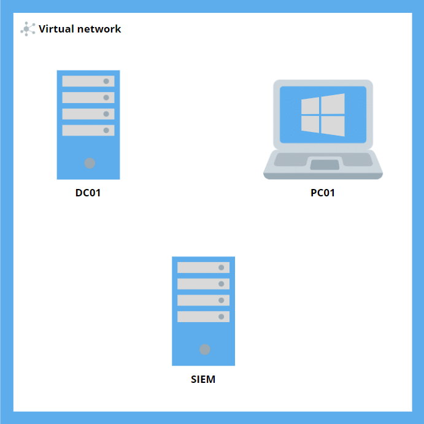

# Your Guide To: AD101, Build your own cybersecurity lab with a SIEM
Note: This lab guide is not enough to setup the lab by itself. This guide was designed to accompany the live workshop that was presented at UTS on the 23rd of August 2022 by UTS CSEC. To access the recording, you can join CSEC here: <insert link>

# Lab Topology

| Windows server VM | Details|
|---|---|
| Computer Name | DC01 |
| Username | Yoda |
| Password | Password1234$ |
| IP address | 10.0.0.4 |
| Domain name | starwars.local |

| Windows 10 pro VM | Details|
|---|---|
| Computer Name | PC01 |
| Username | Kenobi |
| Password | Password1234$ |
| IP address | 10.0.0.5 |
| Domain name | starwars.local |

| Ubuntu VM | Details|
|---|---|
| Computer Name | SIEM01 |
| Username | Anakin |
| Password | Password1234$ |
| IP address | 10.0.0.6 |
| Domain name | starwars.local |

# Quick Reference

## Installing Elastic
Add Elastic's PGP signing key to our APT keyring
```
wget -qO - https://artifacts.elastic.co/GPG-KEY-elasticsearch | sudo apt-key add -
```
Install the apt-tranport-https packae in order to secure traffic between your system and the public repos
```
sudo apt-get install apt-transport-https
```
Add Elastic to our source list
```
echo "deb https://artifacts.elastic.co/packages/7.x/apt stable main" | sudo tee /etc/apt/sources.list.d/elastic-7.x.list
```
Install Elasticsearch and Kibana
```
sudo apt-get update && sudo apt-get install elasticsearch kibana
```
Configure systemd to automatically start Elasticsearch and Kibana after sytem boot-up:
```
sudo /bin/systemctl daemon-reload
sudo /bin/systemctl enable elasticsearch.service
sudo /bin/systemctl daemon-reload
sudo /bin/systemctl enable kibana.service
```

## Configure Elastic 
```
nano /etc/elasticsearch/elasticsearch.yml
```
Look for 'Network' section and uncomment the line for network.host and replace it with the IP address that you assigned to the local server

Uncomment the line for http.port but leave it with the value '9200'

Next, find the section called 'Discovery and add the following line
```
discovery.type: single-node
```
Usually there would be multiple Elasticsearch servers that are joined together in a cluster however we only have one so we are telling Elasticsearch not to try look for others

Restart the elasticsearch service
```
sudo systemctl restart elasticsearch
sudo systemctl status elasticsearch
```

## Configure Kibana
```
nano /etc/kibana/kibana.yml
```
Uncomment the line for server.port 
Uncomment the line for server.host and replace with the IP address of the server
Uncomment the line for elasticsearch.hosts and replace with the IP address of the server

Restart the kibana service
```
sudo systemctl restart kibana
sudo systemctl status kibana
```

## Additional Configuration
```
nano /etc/elasticsearch/elasticsearch.yml
```
Scroll down to the 'Various' section and add the following
```
xpack.security.enabled: true
xpack.security.authc.api_key.enabled: true
#
xpack:
  security:
    authc:
      realms:
        native:
          native1:
            order: 0
```
This will enable X-pack which is an optional extension. One of its features is called realms and allows us to use a Native realm, which essentially means local authentication

Save changes and restart elasticsearch
```
sudo systemctl restart elasticsearch
sudo systemctl status elasticsearch
```

Now move into the /usr/share/elasticsearch/bin folder. Elasticsearch has a number of built-in user accounts and passwords need to be setup for them.  You can set whatever password you want for each account. Just don't forget them 
```
sudo ./elasticsearch-setup-passwords interactive
```
Restart elasticsearch once more
```
sudo systemctl restart elasticsearch
sudo systemctl status elasticsearch
```

```
nano /etc/kibana/kibana.yml
```
Scroll down until you see the section that references the elasticsearch.username and elasticsearch.password

Uncomment these lines and set a username and password. This will be used to authenticate with Elasticsearch.

At the bottom of the config file, add the following lines
```
xpack.security.enabled: true
xpack.ingestManager.fleet.tlsCheckDisabled: true
xpack.encryptedSavedObjects.encryptionKey: "aaaaaaaaaaaaaaaaaaaaaaaaaaaaaaaa"
```

Restart the kibana service
```
sudo systemctl restart kibana
sudo systemctl status kibana
```

# Install and Configure Sysmon
Download Sysmon: https://download.sysinternals.com/files/Sysmon.zip

Create a file called config.xml in C:/Windows and copy and paste the contents of the config.xml file found in this repo

Next, move into the Sysmon folder and install the app
```
.\sysmon64.exe -accepteula -i c:\windows\config.xml
```

# Install and Configure Winlogbeats
Navigate to ```https://artifacts.elastic.co/downloads/beats/winlogbeat/winlogbeat-7.10.1-windows-x86_64.zip``` and download winlogbeats 7.10.1. It is important you get this version

Once downloaded, extract the contents to C:\Program Files

Onced extracted, rename the folder to 'Winlogbeats'

cd into the Winlogbeats foler andexecute the install command
```
.\install-service-winlogbeat.ps1
```

Using a text editor, open winlogbeat.yml

Scroll to Elasticseach Output and change the *output.elasticsearch* host to your Elastic server IP address (keep the port as 9200)

Uncomment the line for protocol and change it to http

Uncomment the line for username and password. Leave the username as elastic and change the password to a value of your choice

Scroll up to a section called Kibana and uncomment the line for the host. Change the value of the IP address to the Elastic server

Save changes and run
```
.\winlogbeat.exe setup -e
Start-Service winlogbeat
```
